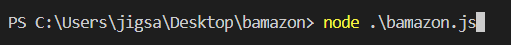
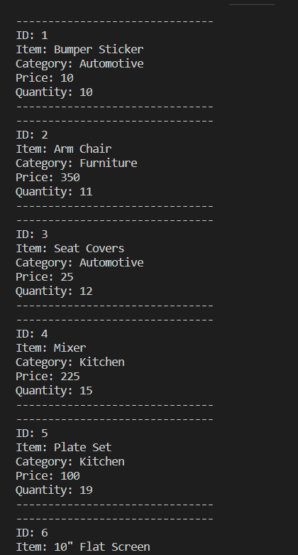
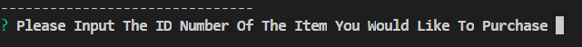
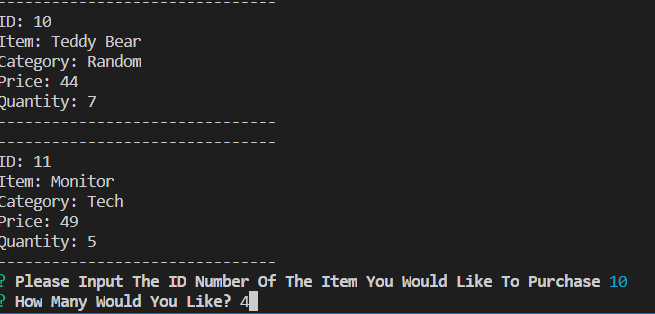
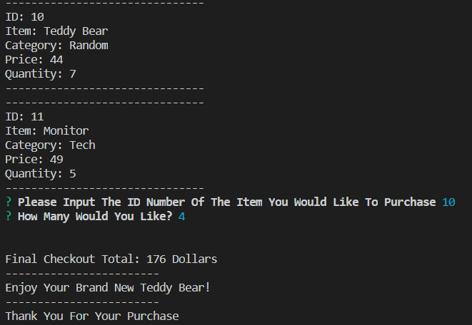
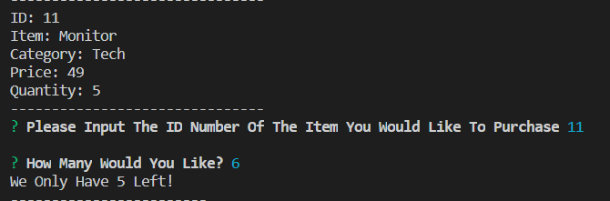
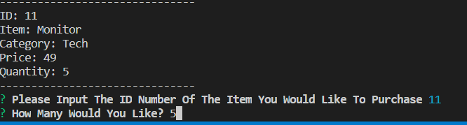
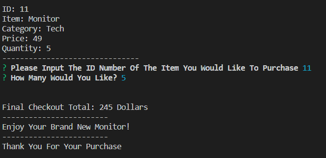
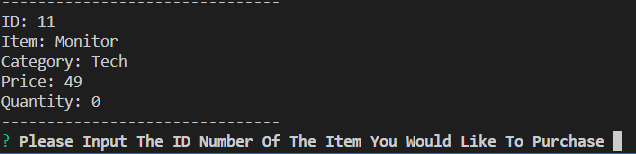

# bamazon application

Welcome to my mock amazon CLI app. Bamazon! (Original I know). This CLI app simulates a customer purchasing items from a web store and then updating the MySQL Database on the backend that our products are stored in. 

So first we run the app with node: 

Then We Are Shown All Our Products: 

After That We Are Prompted To Enter The ID Of The Item We Want To Purchase: 

Then The Amount You Would Like: 

Finally We Are Shown The Amount We Pay And A Thank You:

But Wait...What If We Don't Have That Many To Sell? Well This Happens!

Here are some pictures showing the update in action: 

